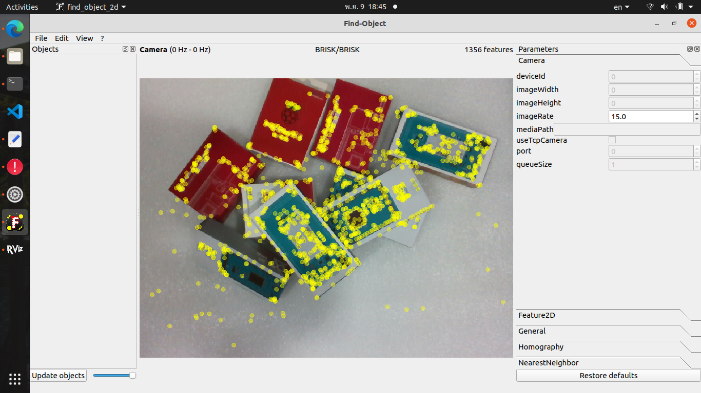
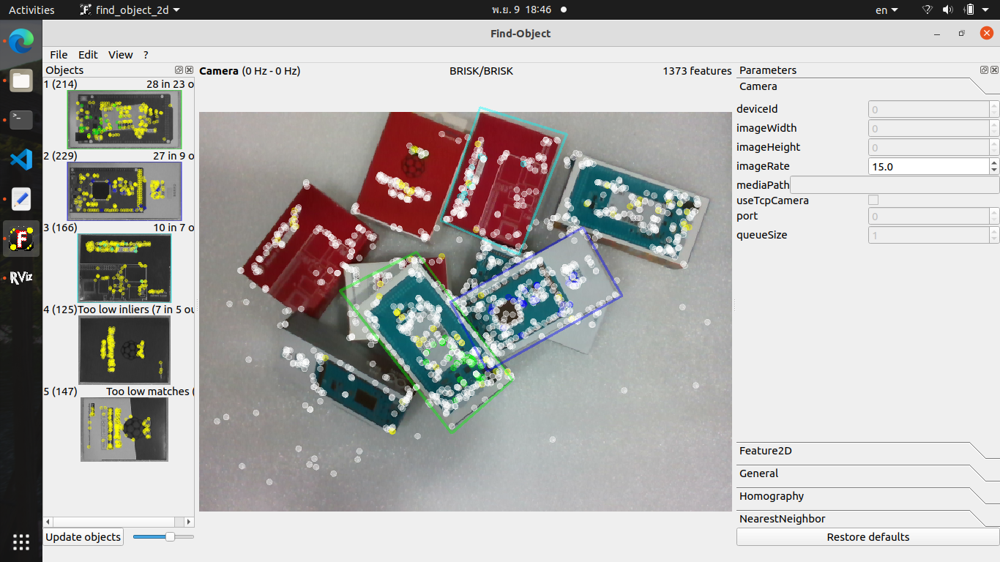
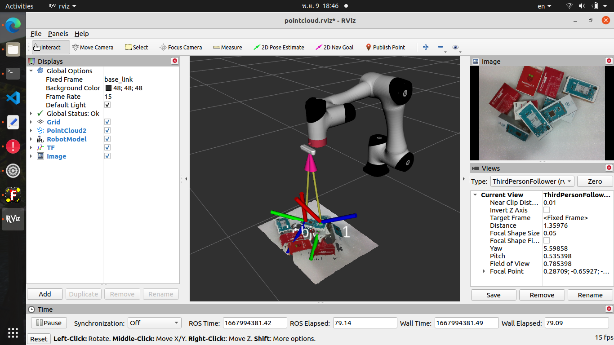
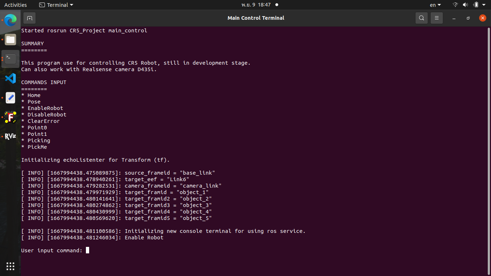

# <center>CR5_Project</center>

Dobot CR5 with Intel Realsense D435i for object detection and pose estimation (bin-picking application).

This project is present the robot arm application especially bin-picking base on Dobot CR5 using ROS which detect an object and 6d pose estimation with intel realsense d435i depth camera by detection [find-object](https://introlab.github.io/find-object/) app.

## Requirement

- ubuntu 20.04
- ROS noetic

# Building

### Use git to clone the source code
```sh
cd $HOME/catkin_ws/src
git clone https://github.com/Dobot-Arm/CR_ROS.git
git clone https://github.com/introlab/find-object.git
git clone https://github.com/monkeyrom/CR5_Project.git
cd $HOME/catkin_ws
```
### Installing Realsense-ROS

You need to install realsense-ros to using realsense2_camera package. The step to installing realsense-ros have shown [here](https://github.com/monkeyrom/realsense-ros).

### building
```sh
catkin_make
```
### set the dobot type
```sh
echo "export DOBOT_TYPE=cr5" >> ~/.bashrc
source ~/.bashrc
source $HOME/catkin_ws/devel/setup.bash
```

## 1.  Launch Project

* Connect the robotic arm with following command, and default robot_ip is 192.168.1.6 

```sh
    roslaunch CR5_Project CR5_with_realsense.launch
```

* this command will launch 
  - dobot_bringup
  - realsense camera pointcloud
  - find object 2d
  - tf synchronisation

### rviz display


### find object GUI



## 2.  Add object image for detection

* Using find object gui for adding image
  - > edit
  - > add object from scene
  - > take picture
  - > crop object



### tf synchronize



## 3.  Run a terminal for controlling robot

```sh
    rosrun CR5_Project service_call.launch
```

* this command will run 2 nodes and spawn new terminal for commanding
  - service_call
  - main_control

### new terminal for input command


## Real Robotic Arm

### Dobot CR5 


### Intel Realsense D435i


# References
- **CR_ROS**: https://github.com/Dobot-Arm/CR_ROS
- **find-object**: https://github.com/introlab/find-object
