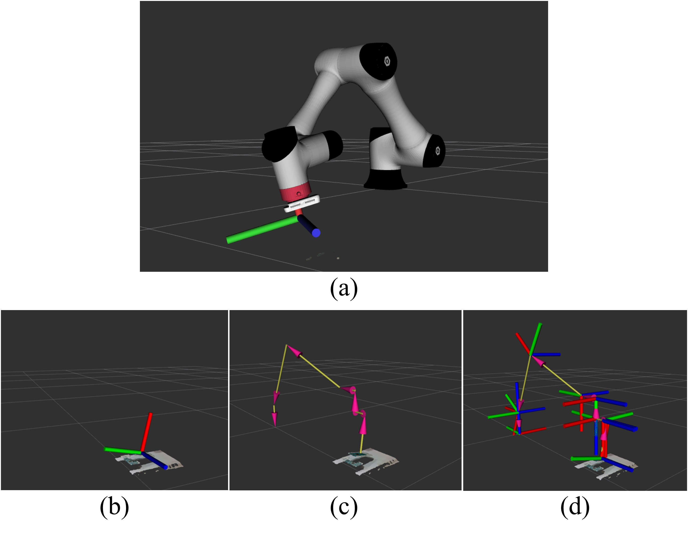
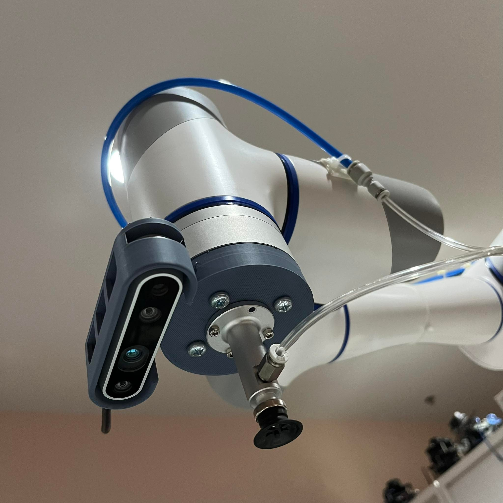

# <center>3D Object Detection and Pose Estimation for Automated Bin-Picking Application</center>
The paper is in the process of being published

### Abstract
Robotic arms have gained popularity in various industries due to their accuracy and efficiency in completing tasks. In this study, we propose a method for automating bin-picking tasks using the Dobot CR5 robotic arm, combining the state-of-the-art YOLOv5 CNN model for object detection with traditional feature detectors, descriptors, and matching techniques. Specifically, we employ the FAST and BRISK algorithms for robust and efficient feature detectors, descriptors, and matching. By integrating these techniques and utilizing a depth sensor camera to capture depth and color images, our system achieves real-time object detection and precise pose estimation, enabling the robotic arm to pick objects accurately. This integration of small-scale camera technology with advanced algorithms contributes to the advancement of industrial robotics, opening up new possibilities for automating challenging tasks and enhancing overall operational efficiency.

Keywords: *robotic arm, bin-picking, YOLOv5 CNN model, depth sensor camera, object detection and pose estimation*


## Requirement

- ubuntu 20.04
- ROS noetic

# Building

### Use git to clone the source code
```sh
cd $HOME/catkin_ws/src
git clone https://github.com/Dobot-Arm/CR_ROS.git
git clone https://github.com/introlab/find-object.git
git clone https://github.com/monkeyrom/3D_Object_Detection_and_Pose_Estimation_for_Automated_Bin-Picking_Application.git
```
### Installing Realsense-ROS

You need to install realsense-ros to use realsense2_camera package. The steps to installing realsense-ros have shown [here](https://github.com/monkeyrom/realsense-ros).

### building
```sh
cd $HOME/catkin_ws/src/Bin-Picking
catkin build
```
### Set the robot type
```sh
echo "export DOBOT_TYPE=cr5" >> ~/.bashrc
source ~/.bashrc
source $HOME/catkin_ws/devel/setup.bash
```

## 1.  Launch Project

* Connect the robotic arm with the following command, and the default robot_ip is 192.168.1.6 

```sh
    roslaunch CR5_Project CR5_with_realsense.launch
```

* This command will launch 
  - dobot_bringup
  - realsense camera pointcloud
  - find object 2d
  - tf synchronisation

### rviz display


### find object

## 2.  FAST and BRISK Traditional object detection for pose estimation


## 3.  Run a terminal for running Yolo node

```sh
    rosrun CR5_Project yolo_order.py
```

* This command will run the node
  - yolo_listener


  
## 4.  Run a terminal for controlling the robot

```sh
    rosrun CR5_Project service_call
```

* This command will run 2 nodes and spawn a new terminal for commanding
  - listener
  - main_order



## Real Robotic Arm


### Intel Realsense D435i


# References
- **CR_ROS**: https://github.com/Dobot-Arm/CR_ROS
- **Intel Realsense**: https://github.com/IntelRealSense/librealsense
- **find-object**: https://github.com/introlab/find-object
- **YOLOv5** : https://github.com/ultralytics/yolov5
