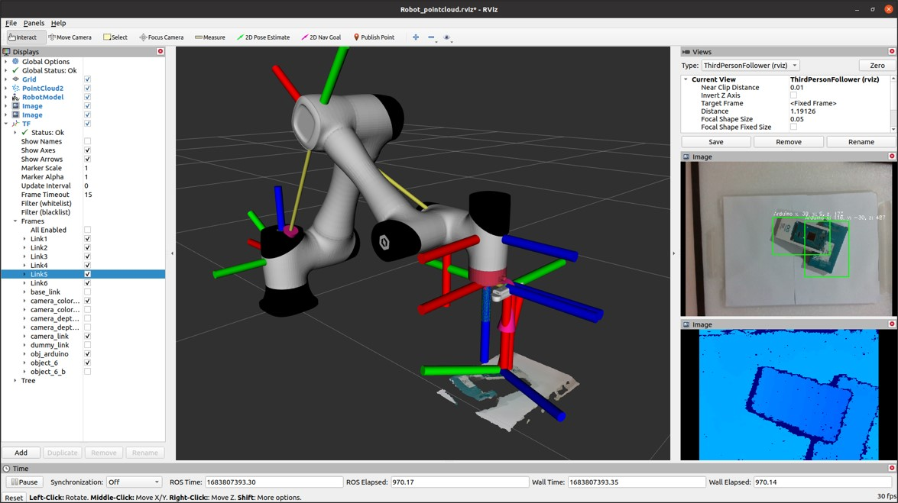

# Hybrid Deep Learning and FAST–BRISK 3D Object Detection for Bin-picking Applications

**Published in:** *Sensors and Materials*, Vol. 36, No. 4(2), pp. 1389–1404  
**DOI:** https://doi.org/10.18494/SAM4840  
**Published Date:** April 19, 2024  
**Paper ID:** S&M3606 Research Paper of Special Issue


## 🧠 Overview

This project presents a hybrid vision-based bin-picking system for collaborative robots. It combines deep learning (YOLOv5) for coarse object detection and classical computer vision algorithms (FAST + BRISK) for precise pose estimation. The system is implemented using the Robot Operating System (ROS) and a low-cost Intel RealSense D435i depth camera in an eye-in-hand setup.

**Key Features:**
- Real-time object detection and 6D pose estimation
- Integration with CR5 collaborative robot
- High detection accuracy and sub-second processing
- Cost-effective hardware setup

---

## 🔍 Abstract

We here propose a hybrid method for bin-picking tasks using a collaborative robot, or cobot combining the You Only Look Once version 5 (YOLOv5) convolutional neural network (CNN) model for object detection and pose estimation with traditional feature detection based on the features from accelerated segment test (FAST) technique, feature description using binary robust invariant scalable keypoints (BRISK) algorithms, and matching algorithms. By integrating these algorithms and utilizing a low-cost depth sensor camera for capturing depth and RGB images, the system enhances real-time object detection and pose estimation speed, facilitating accurate object manipulation by the robotic arm. Furthermore, the proposed method is implemented within the robot operating system (ROS) framework to provide a seamless platform for robotic control and integration. We compared our results with those of other methodologies, highlighting the superior object detection accuracy and processing speed of our hybrid approach. This integration of robotic arm, camera, and AI technology contributes to the development of industrial robotics, opening up new possibilities for automating challenging tasks and improving overall operational efficiency.

> **Keywords**: computer vision, object detection and pose estimation, bin-picking application, robot operating system

---

## 🧩 System Architecture


- Firstly, You Only Look Once Version 5 (YOLOv5), a state-of-the-art deep learning algorithm for object detection, was employed. By leveraging YOLOv5, objects could be detected in real-time streams, and the robot could be precisely moved closer to the targeted object.
- Secondly, the features from accelerated segment test (FAST) and binary robust invariant scalable keypoints (BRISK) algorithms, which are feature detection, description, and matching algorithms, were utilized. As the robot approached close to the object, a high resolution object image was captured by the camera. This image was suitable for using the FAST and BRISK algorithms to rapidly estimate the object’s pose. The combination of these techniques enabled high accuracy in picking up objects at the correct position and orientation.

---

## 🖥️ Requirement

### Hardware
- **Collaborative Robot**: CR5 (DOBOT)
- **Camera**: Intel RealSense D435i (eye-in-hand configuration)
  
### Software
- **OS**: Ubuntu 20.04
- **Middleware**: ROS Noetic

---

## ⚙️ Installation

### 1. Clone Repositories

# Building

### 1. Use git to clone the source code
```sh
cd $HOME/catkin_ws/src
git clone https://github.com/Dobot-Arm/CR_ROS.git
git clone https://github.com/introlab/find-object.git
git clone https://github.com/monkeyrom/3D_Object_Detection_and_Pose_Estimation_for_Automated_Bin-Picking_Application.git
```

### 2. Installing Realsense-ROS

Follow the installation instructions here:
<br /> https://github.com/monkeyrom/realsense-ros

### 3. Build Workspace
```sh
cd $HOME/catkin_ws
catkin build
```

### 4. Set Environment Variables
```sh
echo "export DOBOT_TYPE=cr5" >> ~/.bashrc
source ~/.bashrc
source $HOME/catkin_ws/devel/setup.bash
```

---

## 🚀 Launch the System

* Connect the robotic arm with the following command, and the default robot_ip is 192.168.1.6 

### 1. Start Robot and Camera

```sh
    roslaunch CR5_Project CR5_with_realsense.launch
```

This will:
  - Launch CR5 robot control
  - Stream RGB-D images
  - Run 3D object detection node and 3D Visualization
  - Synchronize TF transforms

#### RViz display



Rviz, the ROS visualization tool, displays the object link, robot model with the camera link, point cloud, depth image, and detected object image.

### 2. Launch YOLOv5 Node

```sh
    rosrun CR5_Project yolo_order.py
```

YOLOv5 detects objects in the scene and sends coordinates to the robot.


---

## 🎯 Object Detection & Pose Estimation

### 🟢 Phase 1: YOLOv5 Detection
- Trained with a custom dataset on Roboflow (1431 images, YOLOv5l, 100 epochs)
- Output: 2D bounding boxes and object class


To train the YOLOv5 model, a dataset was prepared using Roboflow. The dataset was carefully labelled, and various augmentation techniques were applied to enhance its diversity and quality. During the training process, the YOLOv5l model was utilized with 100 epochs, batch size of 16, and the training dataset consisting of 1431 images.

.jpg)

## 🔵 Phase 2: FAST + BRISK for Pose Refinement

### Feature detector — FAST

The algorithm utilizes a circle consisting of 16 pixels, labelled clockwise from 1 to 16, within which a candidate point is assessed, as shown in Fig. 6. By comparing the intensities of the candidate pixel (I) with a threshold value (t), FAST applies the following conditions for corner 

classification:
- Condition 1: If a set of (N) contiguous pixels (S) within the circle satisfies : x p ∀∈ > + x SI I t, the candidate point is classified as a corner.
- Condition 2: If a set of (N) contiguous pixels (S) within the circle satisfies : x p ∀x SI I t ∈ < − , the candidate point is classified as a corner.


The selection of appropriate values for N and the threshold (t) involves consideration of the number of detected corner points and computational efficiency; typically, N is set to 12. Additionally, a high-speed test can be applied to exclude noncorner points, further improving the algorithm’s overall performance. FAST’s rapid intensity comparison process enables real-time corner keypoint detection with high accuracy and efficiency

### Feature descriptor — BRISK

Once keypoints are detected, it is essential to describe their visual attributes in a compact and distinctive technique. This is where feature descriptors come into play. In this research, the BRISK algorithm is utilized as the feature descriptor. BRISK captures the unique characteristics of keypoints by encoding their local appearance, texture, and shape information into a compact binary representation.

### Feature matching

Feature matching techniques are used to establish correspondence between keypoints in the reference and query images. The brute force strategy is applied for nearest neighbour matching, wherein the feature descriptors are compared to find suitable matches. Homography estimation techniques are then employed to determine the geometric transformation between the images. This estimation accurately calculates the object’s pose, including its position and orientation.


By sequentially employing these techniques, the system excels in object detection and pose estimation. The initial top-view detection provides comprehensive workspace coverage, while the subsequent close-up detection offers detailed information for precise pose estimation. This seamless integration within a ROS framework ensures efficient object detection and pose estimation, as depicted by the 6D object link.

## 📐 Robot Pose Calculation

- Pose calculated from camera frame to robot base using transformation matrices in ROS
- Offset applied for precise vertical grasping
- Visualized in RViz with full robot and object models


Within the ROS framework, the object link was established to reference the camera link integrated into the robot’s URDF file. This connection allowed for continuous derivation of the object’s position from the robot’s base link, enabling accurate visualization of both the robot and the object within the Rviz.

## 🤖 Real-world Execution

Run the main control node:

```sh
    rosrun CR5_Project service_call
```

This will:
- Spawn a terminal and run the listener node (robot feedback)
- Launch main_order (control logic)


In the experimental result and comparison, our hybrid method showed impressive performance. In terms of object detection, our approach achieved an AP50:95 score of 96.5%, underscoring its capabilities in accurately detecting objects at any orientation, and a pose estimation accuracy of 94.7% within angle error of 5°. Additionally, our hybrid method demonstrated efficient processing, with a minimal detection and pose estimation time of merely 0.32 s, indicating its suitability for real-time applications. 

## ✅ Conclusion

This project demonstrates a low-cost, accurate, and real-time bin-picking solution by combining the power of deep learning and classical computer vision. Using YOLOv5 and FAST-BRISK within a ROS-based framework, our system offers precise object detection and pose estimation with minimal hardware requirements. It’s a practical and scalable solution for industrial automation in manufacturing and logistics.


# References
- **CR_ROS**: https://github.com/Dobot-Arm/CR_ROS
- **Intel Realsense**: https://github.com/IntelRealSense/librealsense
- **find-object**: https://github.com/introlab/find-object
- **YOLOv5** : https://github.com/ultralytics/yolov5
